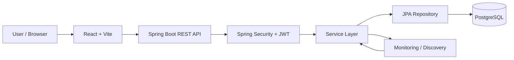
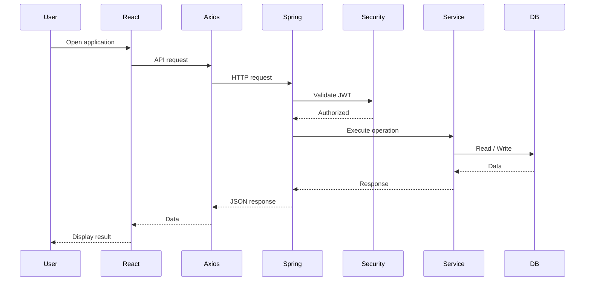
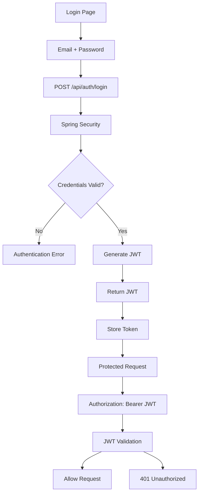
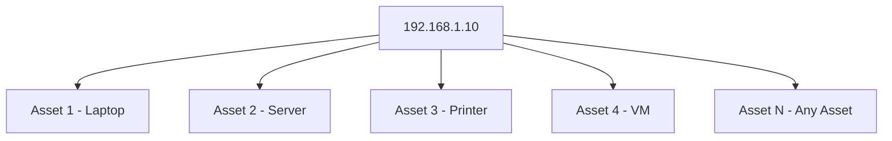
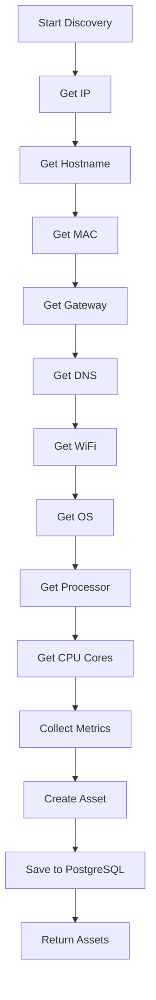
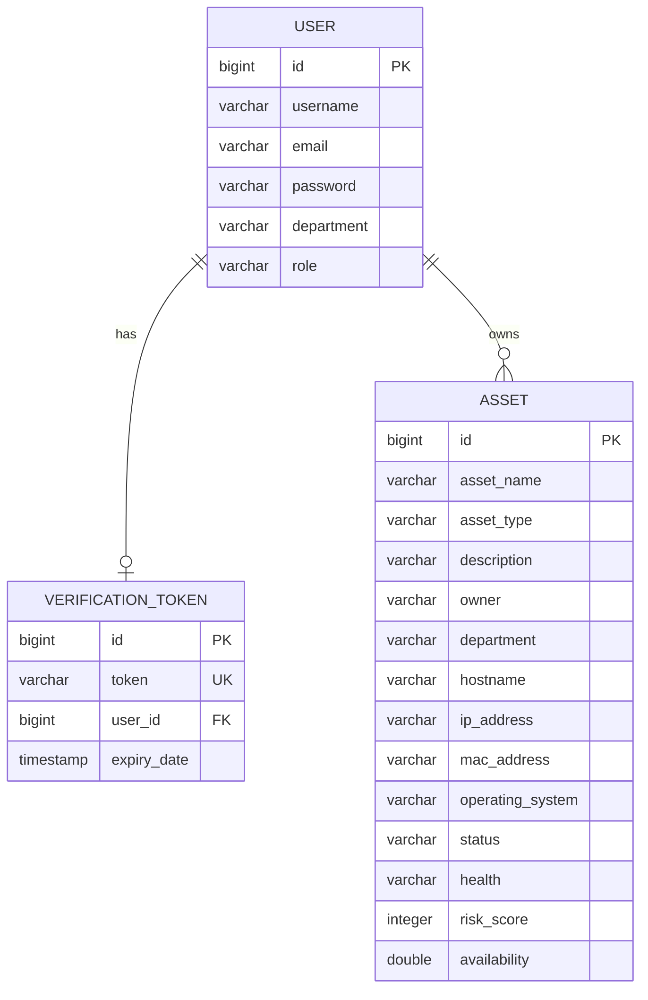
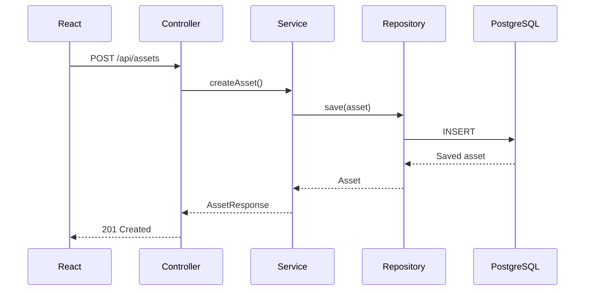
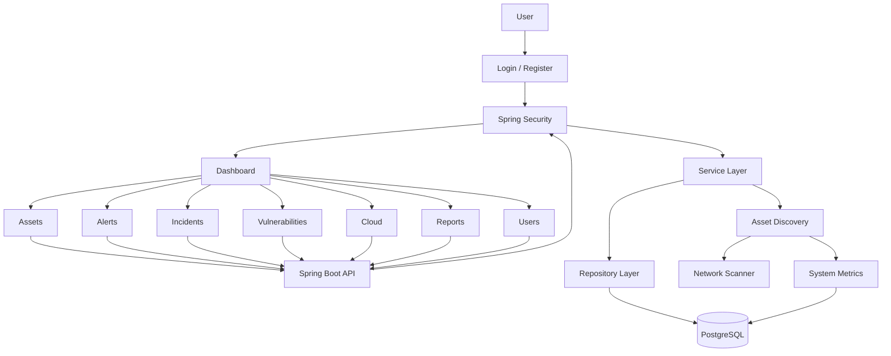

🛡️ Cloud Security Monitoring System
is a full-stack infrastructure monitoring and security operations platform built with React + Vite, Spring Boot, Spring Security/JWT, Spring Data JPA, and PostgreSQL.
The system provides centralized management of IT assets, alerts, incidents, vulnerabilities, cloud resources, reports, users, authentication, role-based authorization, automatic discovery, and responsive/mobile UI.
---
📋 Table of Contents
Overview
Features
Technology Stack
System Architecture
Application Flow
Authentication Flow
Role-Based Access
Asset Management
Multiple Assets With the Same IP
Asset Discovery
Alerts and Notifications
Responsive UI
Frontend Structure
Backend Structure
Database Design
REST API
Security
Configuration
Installation
Running the Project
Troubleshooting
Future Enhancements
---
📌 Overview
Cloud Security Monitoring System provides a centralized interface for monitoring and managing IT infrastructure.
Main modules:
Dashboard
Asset Management
Automatic Asset Discovery
Network Scanning
Alerts
Incidents
Vulnerabilities
Cloud
Reports
User Management
Authentication
Role-Based Access Control
Responsive/Mobile UI
---
✨ Features
Dashboard
The dashboard can display:
Total assets
Healthy assets
Critical assets
Active/inactive assets
Alerts
CPU usage
Memory usage
Disk usage
Network usage
Cloud information
Infrastructure statistics
Asset Management
Authorized users can:
Create assets
View assets
View individual assets
Update assets
Delete assets
Search assets
Filter assets
Assign assets
Transfer assets
Discover assets
Scan networks
Authentication
The project supports:
Registration
Login
Password encryption
JWT authentication
Protected routes
Role-based authorization
Logout
---
🧰 Technology Stack
Layer	Technology
Frontend	React
Build Tool	Vite
Routing	React Router
HTTP Client	Axios
Icons	React Icons
Animation	Framer Motion
Backend	Spring Boot
Language	Java
Security	Spring Security + JWT
ORM	Hibernate / JPA
Database	PostgreSQL
Monitoring	OSHI/system information APIs
AI	Spring AI/OpenAI integration
---
🏗️ System Architecture

The application follows:
```text
React UI
    ↓
Axios
    ↓
Spring REST Controller
    ↓
Spring Security
    ↓
Service Layer
    ↓
Repository Layer
    ↓
PostgreSQL
```
---
🔄 Application Flow

---
🔐 Authentication Flow

---
👥 Role-Based Access
The application uses:
```text
ADMIN
ITSM
USER
```
Typical permissions:
Module	ADMIN	ITSM	USER
Dashboard	✅	✅	✅
View Assets	✅	✅	✅
Create Asset	✅	✅	❌
Update Asset	✅	✅	❌
Delete Asset	✅	❌	❌
Alerts	✅	✅	✅
Incidents	✅	✅	❌
Vulnerabilities	✅	✅	❌
Cloud	✅	✅	❌
Reports	✅	✅	✅
Users	✅	❌	❌
Example:
```java
@PreAuthorize("hasAnyRole('ADMIN','ITSM')")
```
---
🖥️ Asset Management
An asset contains several categories of information.
```text
Asset
├── Basic Information
├── Assignment
├── Network
├── Operating System
├── Hardware
├── Security
├── Discovery
├── Live Metrics
└── Audit Information
```
Basic Information
Asset name
Asset type
Description
Manufacturer
Model
Serial number
Asset tag
Device type
Assignment
Owner
Department
Assigned department
Assigned user
Assigned by
Assignment status
Assigned date
Location
Network
Hostname
IP address
MAC address
Wi-Fi name
Gateway
Subnet mask
DNS server
Operating System
Operating system
OS version
Architecture
Processor
CPU cores
Security
Status
Health
Risk score
Availability
Vulnerability count
Incident count
Patch level
Discovery
Discovered by
Scan status
Scan duration
Discovery date
Discovery time
Discovery timestamp
---
🌐 Multiple Assets With the Same IP
Important Project Requirement
An IP address is NOT a unique asset identifier.
One IP can be associated with any number of asset records.

Example database records:
```text
ID    Asset Name       IP Address
--------------------------------------
1     Laptop-01        192.168.1.10
2     Server-01        192.168.1.10
3     Printer-01       192.168.1.10
4     VM-01            192.168.1.10
```
The unique identifier is:
```java
@Id
@GeneratedValue(strategy = GenerationType.IDENTITY)
private Long id;
```
The IP column should NOT be:
```java
@Column(unique = true)
```
It should be:
```java
@Column(nullable = false)
private String ipAddress;
```
The repository should use:
```java
List<Asset> findAllByIpAddress(String ipAddress);
```
Do not use IP existence as a condition for preventing creation.
---
🔎 Asset Discovery
Automatic discovery collects information from the current machine/network.

A discovery method should not use:
```java
if (repository.existsByIpAddress(currentIp))
```
to prevent another asset from being created, because duplicate IP values are allowed.
---
🔔 Alerts and Notifications
Recent alerts can be requested from:
```text
GET /api/alerts/recent
```
Frontend example:
```javascript
const loadNotifications = async () => {
    try {
        setLoadingNotifications(true);

        const response =
            await API.get("/alerts/recent");

        setNotifications(response.data || []);

    } catch (error) {

        console.error(
            "Unable to load notifications",
            error
        );

        setNotifications([]);

    } finally {

        setLoadingNotifications(false);

    }
};
```
Notification navigation:
```text
Alert Notification
       ↓
User clicks notification
       ↓
/alerts
       ↓
Alerts page
```
---
📱 Responsive UI
The frontend supports desktop and mobile layouts.
Desktop:
```text
┌───────────────┬───────────────────────────┐
│               │ Navbar                    │
│   Sidebar     ├───────────────────────────┤
│               │ Dashboard                 │
│               │ Cards / Tables            │
└───────────────┴───────────────────────────┘
```
Mobile:
```text
┌─────────────────────────┐
│ Navbar             ☰   │
├─────────────────────────┤
│                         │
│ Dashboard               │
│                         │
│ Cards                   │
│                         │
│ Tables / Content        │
│                         │
└─────────────────────────┘
```
The sidebar supports collapse/toggle behavior and the navbar can provide the mobile menu toggle.
---
📁 Frontend Structure
```text
frontend/
│
├── package.json
├── vite.config.js
├── index.html
│
└── src/
    │
    ├── api/
    │   └── axios.js
    │
    ├── components/
    │   ├── Sidebar.jsx
    │   ├── Sidebar.css
    │   ├── Navbar.jsx
    │   ├── Navbar.css
    │   └── ProtectedRoute.jsx
    │
    ├── pages/
    │   ├── Dashboard.jsx
    │   ├── Dashboard.css
    │   ├── Assets.jsx
    │   ├── Assets.css
    │   ├── Alerts.jsx
    │   ├── Incidents.jsx
    │   ├── Vulnerabilities.jsx
    │   ├── Cloud.jsx
    │   ├── Reports.jsx
    │   ├── Users.jsx
    │   ├── Login.jsx
    │   └── Register.jsx
    │
    ├── AuthContext.jsx
    ├── App.jsx
    ├── App.css
    ├── index.css
    └── main.jsx
```
---
⚙️ Backend Structure
```text
backend/
│
├── pom.xml
│
└── src/main/
    │
    ├── java/com/internship/infosys/
    │
    └── resources/
        └── application.properties
```
Recommended Java structure:
```text
com.internship.infosys
│
├── config/
│   ├── SecurityConfig.java
│   └── CorsConfig.java
│
├── controller/
│   ├── AuthController.java
│   ├── AssetController.java
│   ├── UserController.java
│   └── DashboardController.java
│
├── dto/
│   ├── AssetRequest.java
│   └── AssetResponse.java
│
├── model/
│   ├── Asset.java
│   ├── User.java
│   └── VerificationToken.java
│
├── repositary/
│   ├── AssetRepository.java
│   ├── UserRepository.java
│   └── VerificationTokenRepository.java
│
├── service/
│   ├── AssetService.java
│   ├── AssetServiceImpl.java
│   ├── UserService.java
│   └── UserServiceImpl.java
│
└── security/
    ├── JwtUtil.java
    └── JwtAuthenticationFilter.java
```
---
🗄️ Database Design
Main entities:

IP Design
```text
Asset ID       → UNIQUE
IP Address     → NOT UNIQUE
MAC Address    → Can be unique if required
Asset Tag      → Can be unique if required
Serial Number  → Can be unique if required
```
---
🔌 REST API
Base URL:
```text
http://localhost:8080/api
```
Authentication
```text
POST /auth/register
POST /auth/login
```
Assets
```text
POST   /assets
GET    /assets
GET    /assets/{id}
PUT    /assets/{id}
DELETE /assets/{id}
```
Discovery
```text
GET /assets/discover
GET /assets/scan?subnet=192.168.1
```
Search
```text
GET /assets/search?keyword=server
```
Filters
```text
GET /assets/department/{department}
GET /assets/owner/{owner}
GET /assets/status/{status}
GET /assets/health/{health}
GET /assets/department/{department}
GET /assets/owner/{owner}
GET /assets/location/{location}
```
---
🔄 HTTP Methods
Method	Operation	Example
GET	Read	`/api/assets`
POST	Create	`/api/assets`
PUT	Update	`/api/assets/1`
DELETE	Delete	`/api/assets/1`
Example:

---
🔒 Security
Spring Security protects backend endpoints.
Typical rules:
```text
/api/auth/**       → Public
/api/assets/**     → Authenticated
/api/users/**      → Authenticated
/api/dashboard/**  → Authenticated
```
Method-level security:
```java
@PreAuthorize("hasRole('ADMIN')")
```
or:
```java
@PreAuthorize("hasAnyRole('ADMIN','ITSM')")
```
JWT requests use:
```text
Authorization: Bearer <JWT_TOKEN>
```
---
🌍 CORS
Frontend:
```text
http://localhost:5173
```
Backend:
```text
http://localhost:8080
```
Example:
```java
@CrossOrigin(origins = "http://localhost:5173")
```
---
⚙️ Configuration
Example `application.properties`:
```properties
server.port=8080

spring.datasource.url=jdbc:postgresql://localhost:5432/secureops
spring.datasource.username=postgres
spring.datasource.password=YOUR_DATABASE_PASSWORD

spring.jpa.hibernate.ddl-auto=update
spring.jpa.show-sql=false

spring.ai.openai.api-key=${OPENAI_API_KEY}
spring.ai.openai.chat.options.model=${OPENAI_MODEL}
spring.ai.openai.chat.options.temperature=0.7
spring.ai.openai.chat.options.max-tokens=1000
```
Security warning
Never commit real secrets to GitHub.
Do not put real values for:
```text
OPENAI_API_KEY
JWT_SECRET
DATABASE_PASSWORD
```
directly into source control.
Use environment variables or a secret manager.
---
🐘 PostgreSQL Setup
Create the database:
```sql
CREATE DATABASE secureops;
```
Configure:
```properties
spring.datasource.url=jdbc:postgresql://localhost:5432/secureops
spring.datasource.username=postgres
spring.datasource.password=YOUR_PASSWORD
```
Then start Spring Boot.
For development:
```properties
spring.jpa.hibernate.ddl-auto=update
```
For production, use controlled migrations such as Flyway or Liquibase.
---
📦 Installation
Backend
```bash
cd backend
mvn clean install
mvn spring-boot:run
```
Backend:
```text
http://localhost:8080
```
Frontend
```bash
cd frontend
npm install
npm run dev
```
Frontend:
```text
http://localhost:5173
```
---
🔗 Axios Configuration
Example:
```javascript
import axios from "axios";

const API = axios.create({
    baseURL: "http://localhost:8080/api",
});

API.interceptors.request.use((config) => {

    const token =
        localStorage.getItem("token");

    if (token) {
        config.headers.Authorization =
            `Bearer ${token}`;
    }

    return config;
});

export default API;
```
---
🧪 Example Asset
```json
{
  "assetName": "Laptop-01",
  "assetType": "Workstation",
  "description": "Development laptop",
  "manufacturer": "Dell",
  "model": "Latitude",
  "serialNumber": "SN-001",
  "assetTag": "AST-001",
  "deviceType": "Laptop",
  "owner": "Hemanth",
  "department": "IT",
  "hostname": "LAPTOP-01",
  "ipAddress": "192.168.1.10",
  "macAddress": "AA:BB:CC:DD:EE:01",
  "operatingSystem": "Windows",
  "osVersion": "11",
  "architecture": "x64",
  "processor": "Intel Core i5",
  "cpuCores": 8,
  "status": "ACTIVE",
  "health": "Healthy",
  "riskScore": 5,
  "availability": 99.99,
  "vulnerabilityCount": 0,
  "incidentCount": 0,
  "patchLevel": "Latest"
}
```
Another asset may use:
```json
{
  "assetName": "Printer-01",
  "assetType": "Printer",
  "description": "Office printer",
  "owner": "System",
  "department": "IT",
  "ipAddress": "192.168.1.10"
}
```
Both can exist simultaneously.
---
🐛 Troubleshooting
CORS Error
Check:
```text
Frontend: http://localhost:5173
Backend:  http://localhost:8080
```
and configure CORS correctly.
401 Unauthorized
Check:
```text
Token exists
   ↓
Authorization header exists
   ↓
Bearer token is correct
   ↓
JWT is valid
```
403 Forbidden
The token may be valid, but the user may not have the required role.
Check:
```java
@PreAuthorize(...)
```
and the user's role.
Asset 500 Error
Check the Spring Boot console for:
Database constraint errors
Null values
DTO/entity mapping problems
Incorrect column names
Unique constraints
Repository method errors
Duplicate IP Error
If PostgreSQL reports a duplicate-key error for `ip_address`, check the database for a unique constraint/index.
The current requirement is:
```text
ip_address = NOT UNIQUE
```
The asset ID remains unique.
---
🔮 Future Enhancements
Possible future improvements:
WebSocket real-time alerts
Real-time monitoring
SNMP monitoring
Docker monitoring
Kubernetes monitoring
AWS/Azure integration
Advanced vulnerability scanning
SIEM integration
Email notifications
Slack/Teams notifications
Audit logs
Advanced permissions
Password reset
Email verification
Refresh tokens
API rate limiting
Docker Compose
CI/CD
Automated unit/integration tests
Flyway/Liquibase database migrations
---
📊 Complete Project Flow

---
📂 Recommended Repository Layout
```text
Cloud_Security_Monitoring_System/
│
├── backend/
│   ├── pom.xml
│   └── src/
│       └── main/
│           ├── java/
│           └── resources/
│
├── frontend/
│   ├── package.json
│   ├── vite.config.js
│   └── src/
│
├── database/
│
├── docs/
│
├── .gitignore
└── README.md
```
---
👨‍💻 Project Summary
Cloud Security Monitoring System is a full-stack infrastructure monitoring and security operations platform.
The major architecture is:
```text
React
  ↓
Vite
  ↓
Axios
  ↓
Spring Boot REST API
  ↓
Spring Security + JWT
  ↓
Service Layer
  ↓
Spring Data JPA
  ↓
PostgreSQL
```
The platform centralizes:
```text
Assets
Alerts
Incidents
Vulnerabilities
Cloud
Reports
Users
Authentication
Monitoring
Discovery
```
Core Asset Rule
```text
Asset ID       → UNIQUE
IP Address     → NOT UNIQUE
```
Therefore:
```text
192.168.1.10
 ├── Laptop-01
 ├── Server-01
 ├── Printer-01
 ├── VM-01
 └── Any number of additional assets
```
Each asset is independently identified by its database-generated ID.
